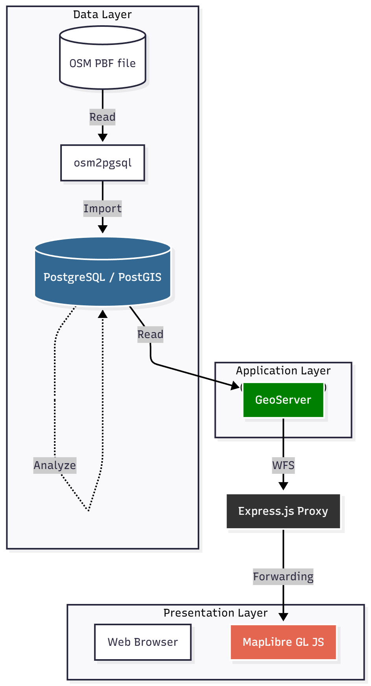

# Tempo 30 zones analysis

A comprehensive project for the automated identification and visualization of Tempo 30 (20 mph / 30 km/h) zones based on OpenStreetMap (OSM) data and PostGIS analysis. A Node.js proxy is included to bypass CORS restrictions between the browser and GeoServer.

## Core components

This project combines several tools for importing, analyzing, and providing geospatial data:

| Component | Layer | Purpose |
| :--- | :--- | :--- |
| **osm2pgsql** | **Data** | Loads OSM data into the database. |
| **PostGIS** | **Data** | Stores road data and performs spatial analysis. |
| **GeoServer** | **Application** | Provides analysis results as a WFS service. |
| **Express.js** | **Service/Middleware** | Proxy to bypass CORS restrictions for WFS queries. |
| **MapLibre** | **Presentation** | Frontend for displaying the identified zones. |

## Installation and setup

### 1. Install OSGeoLive as a virtual machine

### 2. Execute setup

Run the setup shell to install all dependencies and populate the PostGIS database with OSM data.

```bash
chmod +x setup.sh
./setup.sh
````
### 3. Start GeoServer

Start GeoServer inside your OSGeoLive VM. 

### 4. Start proxy

Start the Express proxy server, which acts as an intermediary between your browser and GeoServer.

```bash
node proxy.js
```

### 5. Open application

Open the map.html in your browser to view the analyzed Tempo 30 zones.
---

## Tempo 30 zones logic

The identification of road segments eligible for Tempo 30 follows a two-stage logic: **Zones** and **Connecting Segments**.

### 1. Primary zone identification

Road segments are assigned Tempo 30 zones if one of the following conditions is met.

#### A. Automatic assignment

* **Residential roads:** All roads tagged with `highway=residential` are automatically classified as Tempo 30.

#### B. Conditional assignment (at least one condition must be met)

Applies to the following major road classes:

* `highway=primary`
* `highway=secondary`
* `highway=tertiary`

| Condition             | Description                                                      | OSM Tags (Examples)                                                                                    |
| :-------------------- | :--------------------------------------------------------------- | :----------------------------------------------------------------------------------------------------- |
| **Noise Protection**  | Residential buildings located less than 15 meters from the road. | `building=residential`, `building=apartments`, `building=house`, `building=terrace`                    |
| **Social Facilities** | Sensitive facilities located less than 50 meters from the road.  | `amenity=school`, `amenity=kindergarten`, `amenity=hospital`, `leisure=playground`, `highway=crossing` |

### 2. Zone extension (connecting segments)

After primary zones are identified, the zones are extended based on the following rules:

* **Affected Roads:** Identified zones cover a road segment of 300 meters.
* **Gap Filling:** If the distance between two identified Tempo 30 zones is less than 500 meters, the intermediate segment is also classified as Tempo 30.

# Architecture


